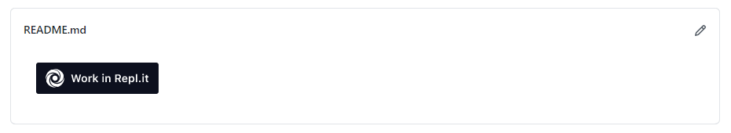
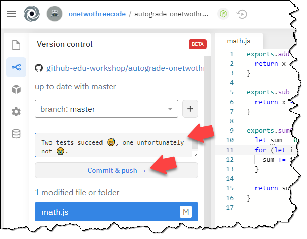
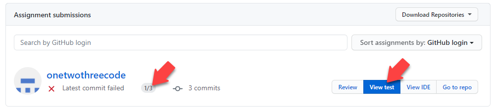
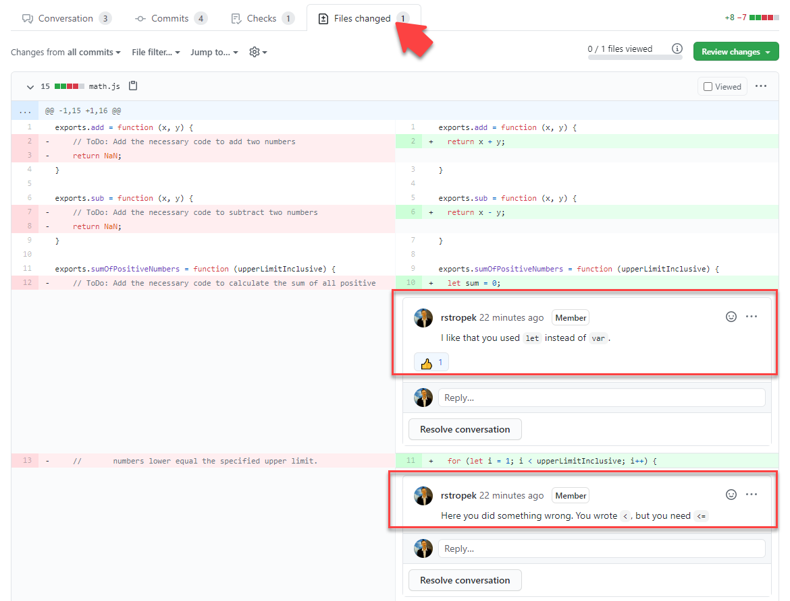

# Hands-on Lab: Autograding and Online IDE

The goal of this hands-on lab is to experience how auto-grading works with *GitHub Classroom*. Note that this lab assumes that you have already done the [*GitHub Classroom* lab](../classroom/readme.md).

## Preparation

1. Form teams of two people. One person plays the role of the student, one person has the role of the teacher. In this guide, we call them
    * *Alice* (student)
    * *Fred* (computer science teacher)

In contrast to the [*GitHub Classroom* lab](../classroom/readme.md), you do not need to install any software (e.g. Node.js, Visual Studio Code) on your computer.

## *Fred*: Organization

Fred can use the organisation and classroom that have been created during the [*GitHub Classroom* lab](../classroom/readme.md).

## *Fred*: Create Assignment

1. For this lab, we will use the same [GitHub repository with starter code](https://github.com/rstropek/GitHubEduWorkshop-JS-Assignment-Starter) as in the previous [*GitHub Classroom* lab](../classroom/readme.md).
    * Note that the starter code is also included in this repository in the [starter-code](starter-code) folder.

1. Open your classroom and create an assignment
    * Title: *JavaScript Quiz with Autograding*
    * Repository prefix: *javascript-quiz-autograding*
    * Type: *Public*
    * *Enable assignment invitation URL*
    * Starter code: *rstropek/GitHubEduWorkshop-JS-Assignment-Starter*
    * Use *Repl.it* as the *Online IDE* for this assignment
      * The *Run command* has to be `npm test`. This will run unit tests when the student clicks on *Run* in *Repl.it*.
      * The *Language* has to be set to *Node.js*
    * Create two autograding tests:
      1. Test name: *Basic*
         * Setup command: `npm install`
         * Run command: `npm test -- --filter=Basic` (runs tests for the basic exercises)
         * Timeout: 1 minute
         * Points: 1
      2. Test name: *Advanced*
         * Setup command: `npm install`
         * Run command: `npm test -- --filter=Advanced` (runs tests for the basic exercises)
         * Timeout: 1 minute
         * Points: 2
    * Activate *Enable feedback pull requests*

1. After the assignment was created, send the *invitation link* to *Alice*

## *Alice*: Take Assignment with *Repl.it*

1. Receive the *invitation link* from *Fred*

1. Accept the assignment by opening the *invitation link*

1. When asked, grant *Repl.it* access to your repositories

1. Open the created GitHub repository online and see how you have received the starter code

1. In the generated GitHub repository, click on *Work in Repl.it*:
   

1. In *Repl.it*, open math.js

1. Follow the exercise guide in the *readme.md* file and solve the quiz. Use the code [in this GitHubGist](https://gist.github.com/rstropek/f9591a9fc47d67f5c63c287fe6700e86) as the solution in this hands-on lab.

1. Try the *Run* button in *Repl.it*. The unit tests should run. Two should succeed, one should fail.

1. Use *Repl.it*'s integrated version control to commit and push your solution
   

## *Fred*: Give Feedback

1. Open the assignment in GitHub classroom. You should see that Alice has accepted the assignment.

1. If you want for a minute or so, you will see that she has gotten 1 of 3 points. You can check the details of the autograding process in *View test*.
   

1. Click on *Review* to navigate to the auto-generated pull request that you can used to provide feedback to Alice

1. In the pull request, navigate to *Files changed*. Add two comments to Alice's code:
   
   1. ``I like that you used `let` instead of `var`.`` with a 👍
   1. ``Here you did something wrong. You wrote `<`, but you need `<=`.``

## *Alice*: Code Fix

Alice has received Fred's comment and wants to enhance her code.

1. Navigate to your assignment's GitHub repository

1. Go to the *Pull requests* tab. There should be one pull request named *Feedback*. Open it.

1. In the *Conversation* area, Alice can see Fred's tips.

1. Go back to *Repl.it* and fix the code. You have to change the `<` in the `for` loop to a `<=`.

1. Use *Repl.it*'s integrated version control to commit and push your solution

## *Fred*: View Final Result

1. Open the assignment in GitHub classroom

1. After a minute or so, you should see that Alice now has 3 points
